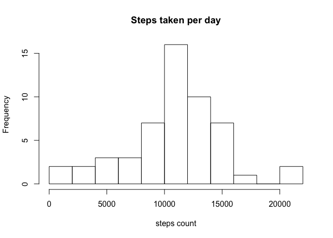
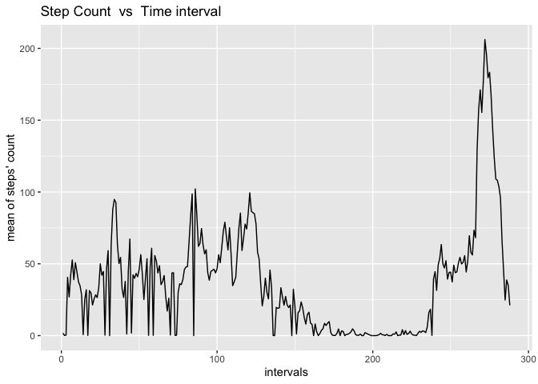
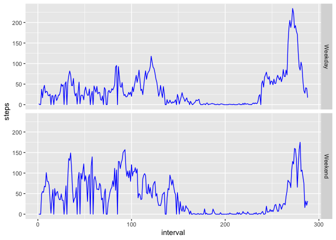

# Introduction 
This file contains the content for Course Project 1 for Reproducible Research Course. The secondary heading were provided under the Project Template and the contents have been populated by the author. The depository was downloaded from the [github repository](https://github.com/rdpeng/RepData_PeerAssessment1). The downloaded folder was set as working directory and subsequent operations were performed within it. 


## Loading and preprocessing the data
The file available in the folder is a zip file. So, first we need to unzip it and then import the data into R. This can be done as following -  


```r
unzip("activity.zip")
# Reading the data 
d <- read.csv("activity.csv")
```

Then, for processing the dates as "Date" variable, it needs to be transformed into date format which is done as follows - 

```r
# processing data
d$date <- as.Date(d$date)
```


## What is mean total number of steps taken per day?
Here three questions are pertinent. We solve them one-by-one.

### 1. Calculate the total number of steps taken per day


```r
datesum <- tapply(d$steps, d$date, sum)
```

### 2.  Make a histogram of the total number of steps taken each day


```r
hist(datesum, breaks = 8, xlab = "steps count", main = "Steps taken per day")
```

<!-- -->

### 3. Calculate and report the mean and median of the total number of steps taken per day


```r
stepmean <- mean(datesum, na.rm = TRUE)
stepmedian <- median(datesum, na.rm = TRUE)
stepmean
```

```
## [1] 10766.19
```

```r
stepmedian
```

```
## [1] 10765
```


## What is the average daily activity pattern?
We want to create a time series plot for the step count in each interval.

* First, interval-wise average step count need to be calculated

* Second, all the intervals need to be stored in a variable 

* Third, a data frame needs to be created by bringing above two together 

* Fourth, plotting the required figure


```r
intervalcount <- tapply(d$steps, d$interval, mean, na.rm = TRUE)
intervals <- levels(as.factor(d$interval))
q2 <- cbind(intervalcount, intervals)
q2 <- as.data.frame(q2)
q2$intervals <- as.numeric(q2$intervals)
q2$intervalcount <- as.numeric(as.character(q2$intervalcount))
library(ggplot2)
g <- ggplot(q2, aes(y = intervalcount, x = intervals)) + geom_line()
g <- g + ggtitle("Step Count  vs  Time interval") +ylab("mean of steps' count")
g
```

<!-- -->

### Next, we need to find which interval contains the maximum number of steps.


```r
#Finding maximum
maxindex <- which.max(q2$intervalcount)
maxinterval <- q2$intervals[maxindex]
maxinterval
```

```
## [1] 272
```


## Imputing missing values

* NAs are replaced with the average values of that interval calculated earlier


```r
#Finding NAs
naindex <- which(is.na(d$steps))

# Creating new Dataset
d2 <- d

#Replacing NAs with average of that interval
d2$steps[naindex] <- intervalcount[naindex]

# Plotting new histogram
datesum2 <- tapply(d2$steps, d2$date, sum)
hist(datesum2, breaks = 8, xlab = "steps count", main = "Steps taken per day")
```

<!-- -->

```r
#Finding new mean and median
stepmean2 <- mean(datesum, na.rm = TRUE)
stepmedian2 <- median(datesum, na.rm = TRUE)
```

### We need to find out the difference between the two


```r
print("Difference between means")
```

```
## [1] "Difference between means"
```

```r
stepmean - stepmean2
```

```
## [1] 0
```

```r
print("Difference between medians")
```

```
## [1] "Difference between medians"
```

```r
stepmedian - stepmedian2
```

```
## [1] 0
```

*Notably, these values do not differ. The mean and the median remain the same.*


## Are there differences in activity patterns between weekdays and weekends?

* The weekends are found using lubridate package wday() function.

* Based on the new weekend column, mutated into the dataframe, we apply the mean function.

* The new dataset is used in ggplot to plot the variation of steps on weekdays and weekends.


```r
library(lubridate)
```

```
## 
## Attaching package: 'lubridate'
```

```
## The following object is masked from 'package:base':
## 
##     date
```

```r
library(dplyr)
```

```
## 
## Attaching package: 'dplyr'
```

```
## The following objects are masked from 'package:lubridate':
## 
##     intersect, setdiff, union
```

```
## The following objects are masked from 'package:stats':
## 
##     filter, lag
```

```
## The following objects are masked from 'package:base':
## 
##     intersect, setdiff, setequal, union
```


```r
d <- mutate(d, weekend = ((wday(date) == 1) | (wday(date) == 7)))
d$weekend <- as.factor(d$weekend)
levels(d$weekend) <- c("Weekday", "Weekend")
divided <- with(d, tapply(steps, list(interval, weekend), mean, na.rm =  TRUE))
divided <- as.data.frame(divided)
l <- length(divided[,1])
divided <- unlist(divided)
daytype <- c(rep("Weekday", l), rep("Weekend", l))
intervaltype <- c(intervals, intervals)
divided <- cbind(divided, daytype, intervaltype)
divided <- as.data.frame(divided)
names(divided) <- c("steps", "day_type", "interval")
divided$interval <- as.numeric(as.factor(divided$interval))
divided$steps <- as.numeric(as.character(divided$steps))

g2 <- ggplot(divided, aes(x = interval, y = steps))
g2 <- g2 + geom_line(col = "blue") + facet_grid(day_type ~ .)
g2
```

<!-- -->
